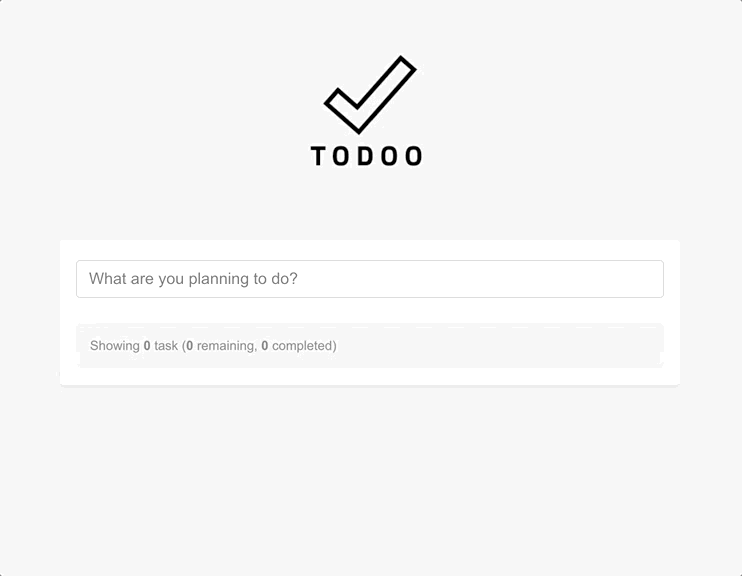

# Vue client for Todo API

This repo includes a frontend application made with vue. 
[It uses the todo api written with Golang for the backend](https://github.com/hakanyolat/go-todo-api).



### Installation

1. Clone this repository.

```bash
$ git clone git@github.com:hakanyolat/todo-api-vue-client.git
```

2. Install dependencies with ```npm```.

```bash
$ npm install
```

### Configuration

This app uses a [backend](https://github.com/hakanyolat/go-todo-api) service. 
You must specify the host of this backend service. 
You can find this setting in the ```.env``` file.

Alternatively, you can set the environment value as in the example below.

```bash
$ export VUE_APP_API_SERVER=http://127.0.0.1:3000
```

### Run

1. Compiles and hot-reloads for development.

```bash
$ npm run serve
``` 

2. Compiles and minifies for production.

```bash
$ npm run build
```

### Test

```bash
$ npm run test:unit
```

### Lints and fixes files

```bash
$ npm run lint
```
